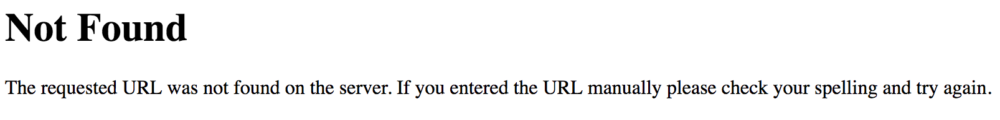

# Python - Getting Started with Flask

## Introduction
In this lab we are going to practice making a very simple web application. To do this, we will be using a framework called Flask, which allows us to create an application that communicates with our browser. We will define a route, and have it return a string "Hello world". Finally, we will start a local server and visit the route in our browser, which will make a request to our program, which should then return our "Hello world" string. Don't worry if that sounds a bit confusing. It will become a lot clearer shortly. Let's get started!

## Objectives
* Install the microframework Flask
* Create a new Flask app
* Spin up a server to run our Flask app
* Define routes that return text

## Getting Started
Okay, first thing we need to get started is make sure we have Flask installed on our local computer. So, let's install Flask. 

We can install Flask by simpling uncommenting out the line below and running the cell:


```python
# pip install flask
```

Once Flask is installed we can move on to getting our app up and running.

## Creating a New Flask App
Next we are going to be using our file called `hello_world.py`. We will need to import Flask like so:
```python
from flask import Flask
```
Then we need to define a variable, let's call it `app`. Assign `app` to a new instance of the Flask class with `__name__` as its argument (i.e. `Flask(__name__)`. Don't worry to much about the `__name__` right now. Just know that it is Flask's way of determining the best way to import other files and modules inside your application. When the file is run, `__name__` resolves to `"__main__"`.

Great! now we have the beginnings of our Flask app set up. Our variable `app` represents a Flask object which we can use to continue building our app.

## Running Our App

Alright, our app doesn't do much of anything yet but we did just say that we created a new Flask object and this is a Flask app after all. Let's run it!

To start a Flask app we need to tell it to run. So, below where we have our `app` variable defined, let's tell our app to run. And since we want to know of any errors we encounter, let's tell our `app` to show any errors we encounter with `debug=True`.

```python
if __name__ == '__main__':
    app.run(debug=True)

```

Awesome, now we just need to run our `hellow_world.py` file with `python hello_world.py` and our app will start a server that is running on our computer. To see our app running, visit `http://127.0.0.1:5000/` in your browser. Alternatively we can type `localhost:5000` into our url to see our app running. 

Once you get your server up you should see this displayed:



**Oh no!**


Alright, unfortunately we haven't yet told our app what to do when someone visits it. Our 404 message even tells us that our server couldn't find the URL we requeste (i.e. `'/'`). So, we need to tell our app how to handle a request from a server or client. How do we do that? With routes, of course! Let's get some routes defined.


## Defining Some Routes

Alright, we have the beginning of our app set up and a server running, but we want to tell our app what to do when a request is made. The first route we will need is the index (`'/'`), so, let's define a route and a function to return some text when a client requests the index route.

> **Remember:** *we need to use a decorator to attach or wrap the function definition below together with our route.*

```python
@app.route('/')
def index():
    return "Hello, world!"
    
```

Woo! Now when someone visits the root route or index of our app, they see the text `"Hello, world!"`. 

Let's take this a step further and define a few more routes.  The function defined with each route should have its own unique name.  For example, our app would break if we created a route for `'/home'` with the function `index()` because Flask would attempt to overwrite the previous `index()` function used in the `'/'` route.  For the purposes of this lab, it makes sense to give each function the same name as the route it is associated with.  Therefore, the `'/home'` route should include the function `home()`.

* Define a route for `'/home'` which shows the text `"Welcome to an amazing Flask App!"`
* Define a route for `'/myprofile'` which shows the text `"This is my profile! It's not finished yet... :/"`
* Define a route for `'/exit'` which shows the text `"Thanks for looking around. Come back again soon!"`

## Summary

Great work! In this lab we installed the microframework Flask and used it to create a simple web app! We created a new Flask app and started our server. Then after seeing that our server didn't know how to handle a request to the index route, we defined a few routes and had them return some text when a client requests the route. This isn't terribly complex, but our apps will be able to do much more once we learn more about Flask and the web.
